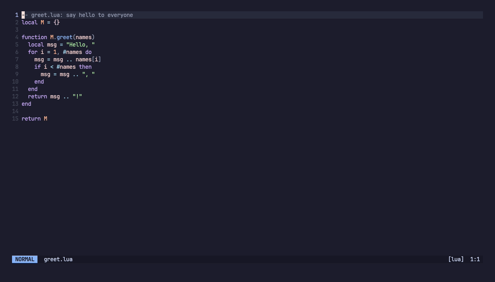

# agent.nvim

Run Claude Code, OpenCode, GitHub Copilot CLI and Gemini CLI in a Neovim terminal, with Neovim
itself serving the IDE integration each CLI expects from VS Code. Like
[coder/claudecode.nvim](https://github.com/coder/claudecode.nvim), but for four agents.



The real Claude Code TUI running in agent.nvim, with the model's replies scripted so that the
recording is reproducible (see [demo/](demo/)). [MP4 version](demo/agent-nvim-demo.mp4).

## Features

- Agents run in a split, float or tab. `:Agent` toggles the terminal; the agent keeps running
  while hidden.
- The agent sees your current file and selection, and you can @-mention files and line ranges.
- Proposed edits open as a side-by-side diff in Neovim: accept with `:w`, reject by closing it.
- The [$NVIM controller](#the-nvim-controller), registered automatically, lets the agent drive the
  Neovim it runs in.
- Pure Lua, no dependencies. Servers listen only on loopback or a private Unix socket and require
  a token.

| Agent | Selection | @-mentions | Diffs in Neovim | Diagnostics |
|---|---|---|---|---|
| Claude Code (`claude`) | yes | yes | yes, editable | yes |
| OpenCode (`opencode`) | yes | yes | no | through the controller |
| GitHub Copilot CLI (`copilot`) | yes | yes | yes, read-only | yes |
| Gemini CLI (`gemini`) | yes | typed into the prompt | yes, editable | through the controller |

## Requirements

- Neovim 0.11 or newer (`vim.pack` needs 0.12).
- At least one agent CLI on `$PATH`. The IDE protocols are undocumented and change between
  releases; they were verified against Claude Code 2.1.283, OpenCode 1.18.32, Copilot CLI 1.0.88
  and Gemini CLI 0.61.0.
- Tested on macOS. Linux support exists but has not been tested live; Windows is untested.

## Installation

With [lazy.nvim](https://github.com/folke/lazy.nvim):

```lua
{
  'Shooooooooo/agent.nvim',
  main = 'agent',
  opts = {},
  keys = {
    { '<leader>ac', '<cmd>Agent<cr>', desc = 'Toggle agent' },
    { '<leader>as', '<cmd>AgentSend<cr>', mode = 'x', desc = 'Send selection to agent' },
    { '<leader>ab', '<cmd>AgentAdd<cr>', desc = 'Add current file to agent' },
  },
  cmd = { 'Agent', 'AgentOpen', 'AgentSend', 'AgentAdd', 'AgentStatus', 'AgentMcpConfig', 'AgentGeminiSetup' },
}
```

With `vim.pack` (Neovim 0.12+):

```lua
vim.pack.add({ 'https://github.com/Shooooooooo/agent.nvim' })
vim.keymap.set('n', '<leader>ac', '<cmd>Agent<cr>', { desc = 'Toggle agent' })
vim.keymap.set('x', '<leader>as', '<cmd>AgentSend<cr>', { desc = 'Send selection to agent' })
vim.keymap.set('n', '<leader>ab', '<cmd>AgentAdd<cr>', { desc = 'Add current file to agent' })
```

## Quick start

1. Run `:checkhealth agent` to see which agent CLIs are installed and whether anything blocks the
   connection.
2. Run `:Agent` to open Claude in a split on the right (or `:Agent opencode`, `:Agent copilot`,
   `:Agent gemini`). The agent connects to Neovim by itself; Gemini needs a
   [one-time setup](#gemini-cli) first.
3. Select lines and run `:AgentSend` (`<leader>as`) to @-mention them. `:AgentAdd` mentions the
   current file.
4. Ask for a change. When the agent asks for permission, a diff tab opens: accept with `:w` or
   `<leader>aa`, reject with `<leader>ad` or by closing the tab. Claude Code's default mode
   rarely asks, see [Claude Code](#claude-code).
5. Run `:Agent` again to hide the terminal. The agent keeps running.

## Commands

| Command | Description |
|---|---|
| `:Agent [name]` | Toggle an agent terminal, starting the agent if needed. |
| `:AgentOpen [name]` | Open (start or show) an agent terminal and focus it. |
| `:AgentClose [name]` | Hide the terminal. The agent keeps running. |
| `:AgentStop [name]` | Stop the agent. `:AgentStop!` stops every agent and IDE server. |
| `:[range]AgentSend [name]` | @-mention the selected lines. |
| `:AgentAdd [file] [start] [end]` | @-mention a file (default: the current one), optionally a line range. |
| `:AgentDiffAccept` | Accept the current diff. |
| `:AgentDiffReject` | Reject the current diff. |
| `:AgentStatus` | Show the agents and the IDE servers. |
| `:AgentMcpConfig [agent]` | Print the config for registering the $NVIM controller by hand. |
| `:AgentGeminiSetup` | Link the agent.nvim extension into Gemini CLI (once). |

`[name]` defaults to the most recently focused running agent, then to `default_agent`.

## Configuration

`setup()` is optional: every command calls it on first use. The options you are most likely to
change, with their defaults:

```lua
require('agent').setup({
  default_agent = 'claude',
  terminal = {
    layout = 'split',       -- 'split' | 'float' | 'tab' | 'none'
    split_side = 'right',   -- 'right' | 'left' | 'below' | 'above'
    split_size = 0.4,       -- fraction of the editor width (or height)
  },
  diff = {
    keymaps = { accept = '<leader>aa', reject = '<leader>ad' }, -- '' or false disables a key
  },
  agents = {
    -- the same keys exist for opencode, copilot and gemini
    claude = {
      cmd = { 'claude' },
      args = {},              -- extra CLI arguments
      auto_approve = false,   -- pre-approve the $NVIM controller's tools
    },
  },
  nvim_mcp = { enabled = true }, -- register the $NVIM controller
})
```

Full reference: `:help agent-config`.

## Agent notes

### Claude Code

- Diffs open only when Claude asks for permission. Its default mode (auto, as of 2.1.283) applies
  most edits without asking. To review edits in Neovim, start it in manual mode with
  `agents = { claude = { args = { '--permission-mode', 'manual' } } }`, or switch modes with
  Shift+Tab or `/config` in Claude.
- Claude does not open a diff for a file with unsaved changes in Neovim.

### OpenCode

- Connects through the Claude IDE server's lock file in `~/.claude/ide`; nothing to set up.
- It only receives the selection and @-mentions: its edits are written directly, so there are no
  diffs in Neovim. The $NVIM controller works.

### GitHub Copilot CLI

- **Security:** `providers.copilot.trust_workspace = true` makes Copilot skip its folder-trust
  prompt and load the repository's own MCP servers, settings and hooks without asking. Leave it
  `false` (the default), or pass a `function(folder)` that returns `true` only for folders you
  trust.

### Gemini CLI

- One-time setup: run `/ide enable` inside Gemini, and `:AgentGeminiSetup` in Neovim (it links the
  extension that registers the $NVIM controller).
- Gemini refuses the controller in untrusted folders: trust the folder in Gemini, or set
  `agents.gemini.skip_trust = true`, which makes Gemini trust any folder it is launched in.

## The $NVIM controller

For each agent it launches, agent.nvim registers a stdio MCP server through which the agent can
drive the Neovim it runs in, without editing your agent config files. Its tools:
`get_editor_state`, `list_buffers`, `read_buffer`, `edit_buffer`, `open_file`, `get_diagnostics`,
`execute_command`, `eval`, `exec_lua`, `notify`. For an agent you start yourself in a Neovim
terminal, `:AgentMcpConfig` prints the config to add, and `auto_start = true` lets it use the IDE
connection too (`:help agent-nvim-mcp-manual`).

**Security:** the controller can do anything your Neovim can. `exec_lua`, `execute_command` and
`eval` run arbitrary Lua, Ex commands and Vimscript as you, shell commands included. Claude,
Copilot and Gemini ask before each call (following their own permission settings) unless you opt
in with `agents.<name>.auto_approve = true`; OpenCode allows all tools unless its own
`permission` config says otherwise. Turn the controller off with `nvim_mcp.enabled = false`, or
per agent with `agents.<name>.mcp = false`.

## More

- `:help agent.nvim`: the full reference (options, Lua API, events, per-agent details,
  troubleshooting).
- `:checkhealth agent`: checks the agent CLIs, the IDE servers and the controller.
- [docs/PROTOCOLS.md](docs/PROTOCOLS.md): the four IDE protocols, for contributors.
- Tests: `make test` (Lua specs and MCP SDK conformance), `make test-e2e` (live, real agent CLIs).
- Demo: `make demo` re-records the GIF and MP4 (see `:help agent-demo` and `demo/record.sh`).

## Credits

The Claude IDE protocol implementation follows
[coder/claudecode.nvim](https://github.com/coder/claudecode.nvim), whose Lua server and protocol
notes were the reference.
